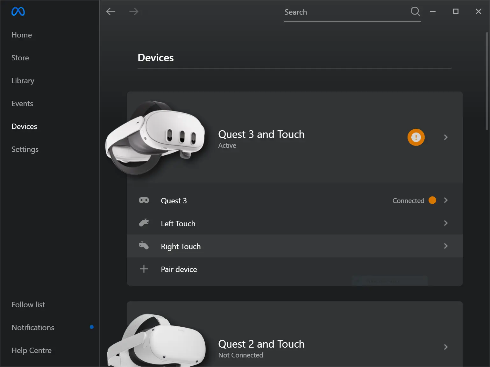
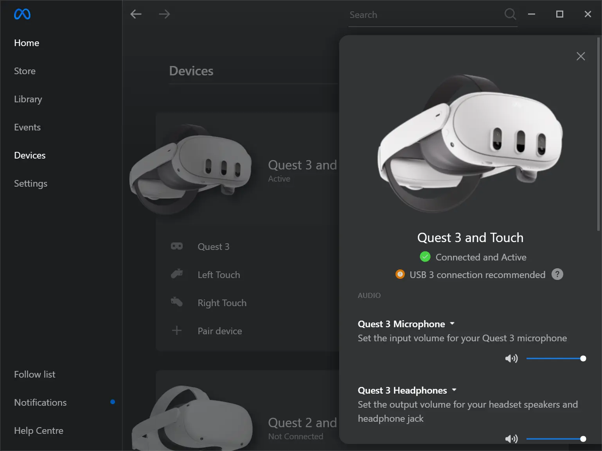
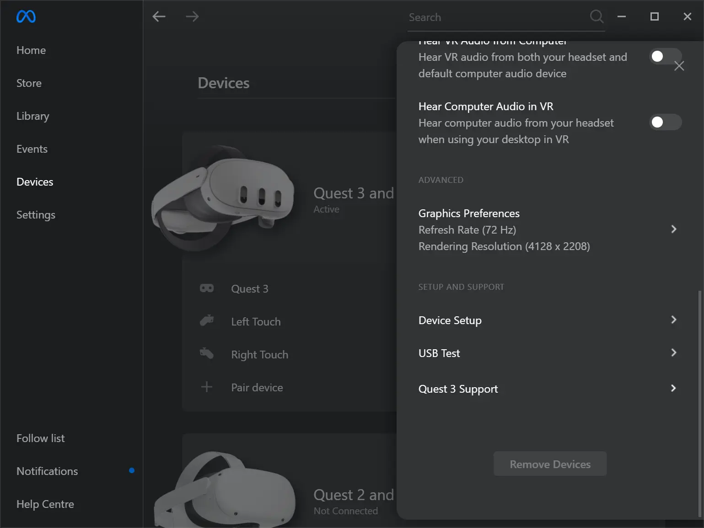
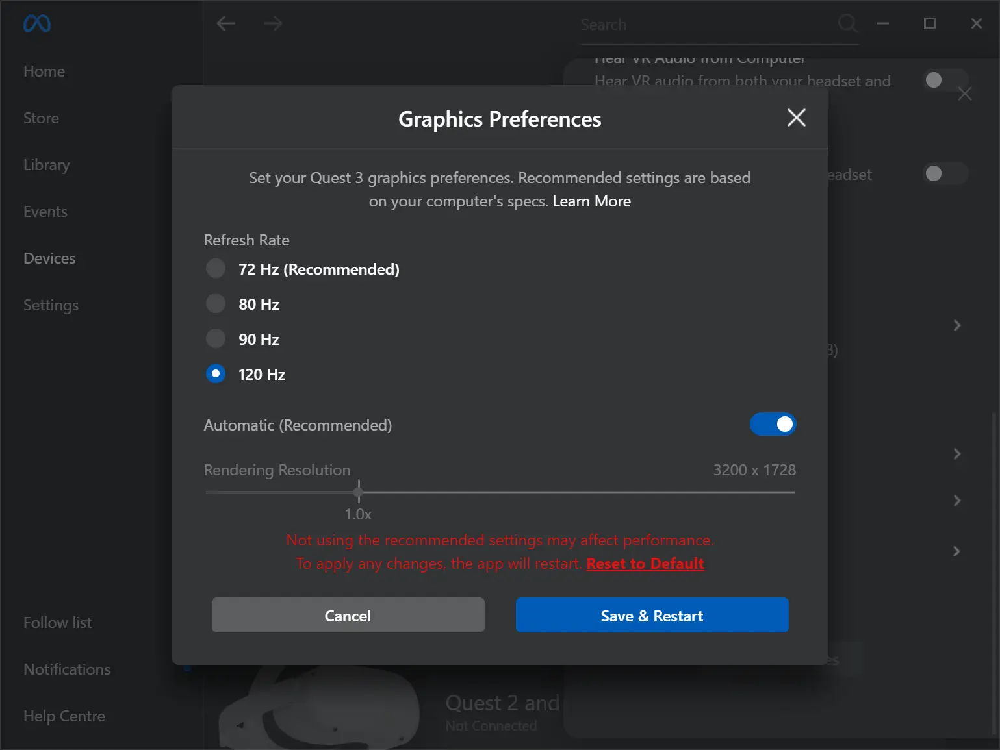
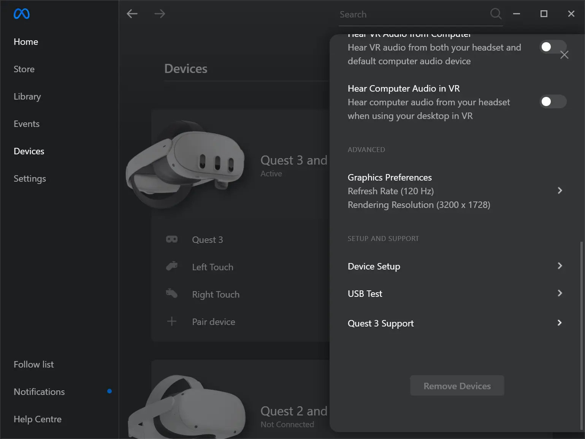
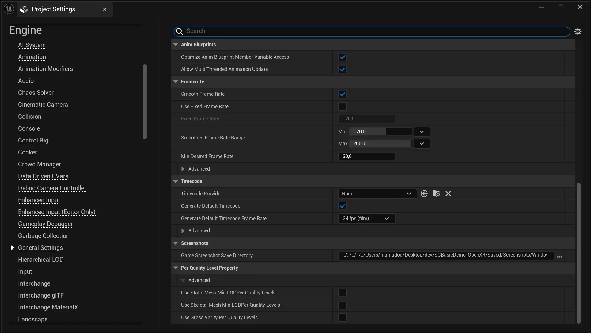
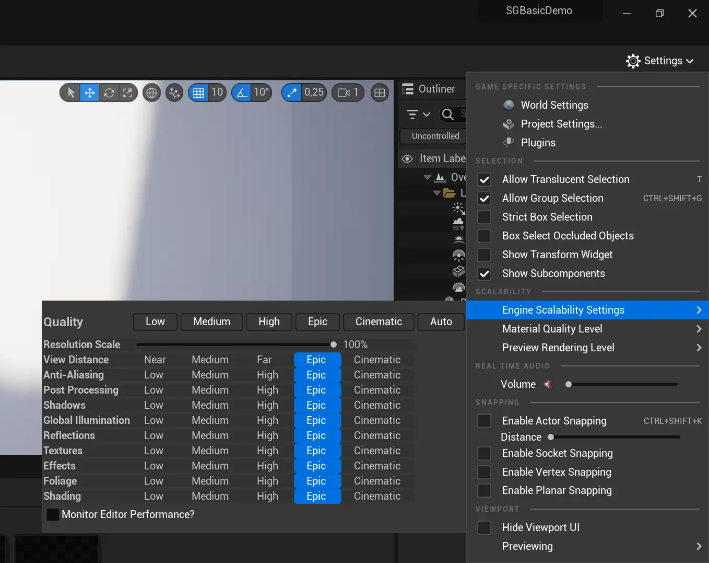

+++
title = "Optimizing Unreal Engine VR Projects for Higher Framerates (Meta Quest Tips Included!)"
slug = "optimizing-unreal-engine-vr-projects-higher-framerate"
date = 2025-01-02T02:17:00+01:00
tags = [ "Android", "Blueprint", "Epic Games", "Game Development", "Game Programming", "gamedev", "HTC VIVE", "Meta Quest", "Oculus", "Oculus Quest", "OpenXR", "Optimization", "PCVR", "UDK", "UE4", "UE5", "Unreal Engine", "UnrealScript", "Virtual Reality", "VR", "Windows", "XR" ]
toc = true
+++



Ever felt like your VR project is running so slow it could be a snail's day job? 🐌 Or maybe your framerate is auditioning for a role in The Matrix—dodging bullets, but also every performance standard? 😅

Well, today, we're fixing that! I’ll show you how to take your Unreal Engine VR game from ‘meh’ to chef’s kiss smooth. Although enhancing the performance and framerate of Unreal Engine VR applications, whether running in standalone mode (Android mobile) or PCVR mode (PC streaming), can feel daunting, especially when dealing with varying project requirements, this guide breaks down practical and easy-to-implement strategies that deliver noticeable results with minimal hassle, helping you achieve smoother gameplay.

So, let’s get started before that snail finishes its coffee break!

<!--more-->

## English Video Tutorials

- The video tutorial:

 

## PCVR Mode

Here are some crucial guidelines that you might consider adjusting to optimize performance in PCVR mode.

### Enhancing Meta Quest Link Graphics Settings

The default refresh rate is set at `72 Hz` when streaming from a PC to Meta Quest devices. However, you can increase this up to `120 Hz`, which enhances the refresh rate and reduces the rendering resolution, potentially improving performance. Follow these steps to adjust refresh rate:

1. Open the **Meta Quest Link** app and go to the `Devices` tab.

2. Select the device you want to adjust the refresh rate for.

3. In the device settings, navigate to the `Advanced` section and click on `Graphics Preferences`.

4. Select your preferred refresh rate, such as `120 Hz`. Once selected, click `OK` to confirm, and the Meta Quest Link app will automatically restart to apply the changes.

5. After the Meta Quest Link app restarts, revisit the `Devices` tab, select your device, and verify the refresh rate setting in `Advanced > Graphics Preferences`.

6. Next, open your Unreal Engine project and go to `Project Settings` to fine-tune your project’s framerate. Under `Engine > General Settings > Framerate`, adjust and experiment with the framerate settings to suit your project's specific needs.

## Standalone Mode (Mobile)

Optimizing performance for mobile platforms requires careful attention to specific settings. Here are some essential adjustments to maximize performance and efficiency for mobile devices.

---

### General Rendering Settings

**Forward Shading**: Enable Forward Shading for improved efficiency. It’s optimized for mobile platforms.

 - Rendering Settings - Forward Renderer")

 - Rendering Settings - Mobile")

**Mobile HDR**: Disable this option to conserve resources. HDR can have a significant performance impact, especially on lower-end devices.

 - Rendering Settings - VR")

**Instanced Stereo**: Activate this setting to streamline rendering by reducing the workload for VR applications, where two slightly different images are needed for each eye.

 - Rendering Settings - VR")

**Mobile Multi-View**: Enable this feature for optimized VR rendering on mobile devices, especially when using platforms like Google Daydream or Samsung Gear VR.

 - Rendering Settings - VR")

**Mobile Anti-Aliasing Method**: Choose `FXAA (Fast Approximate Anti-Aliasing)` or `MSAA (Multisample Anti-Aliasing)` for smoother visuals. `MSAA` offers better quality with minimal performance impact.

 - Rendering Settings - Mobile")

**Reflection Capture Resolution**: Lower the resolution (e.g., 128 or 256) to save memory.

 - Rendering Settings - Reflections")

---

### Texture Settings

**Enable Virtual Texture Support**: Turn this setting off for better performance.

 - Rendering Settings - Virtual Textures")

**Texture Streaming**: Enable texture streaming to load textures progressively, reducing memory usage.

 - Rendering Settings - Textures")

**Texture Quality**: Adjust to Medium or Low, depending on the capabilities of the target device.

**Texture Compression**: Use ASTC compression for Android devices to ensure optimized texture performance.

---

### Lighting Settings

**Static Lighting**: Use static lighting instead of dynamic lighting to save processing power.

**Lightmap Resolution**: Opt for lower lightmap resolutions (e.g., 32 or 64) to minimize memory usage.

**Dynamic Shadows**: Disable or reduce dynamic shadows. If necessary, use Cascaded Shadow Maps (CSM) with reduced resolution and range.

**Distance Field Shadows/Ambient Occlusion**: Turn these features off as they are resource-intensive.

 - Rendering Settings - Default Settings")

---

### Post-Processing Settings

**Bloom, Lens Flares, and Auto Exposure**: Minimize or disable these effects to save resources.

 - Rendering Settings - Default Settings")

**Screen Space Reflections**: Turn this off to reduce performance strain.

**Motion Blur**: Disable to conserve processing power.

 - Rendering Settings - Default Settings")

---

### Materials and Shaders

**Material Complexity**: Simplify materials by minimizing instructions and limiting textures or shader nodes.

**Specular Highlights**: Reduce or disable to optimize performance.

**LOD (Level of Detail) Models**: Ensure models have LODs configured, reducing polygon count for distant objects.

---

### Level of Detail (LOD) Settings

**Mesh LODs**: Configure all meshes with appropriate LODs to reduce polygons as objects move further away.

**Screen Size**: Adjust LOD screen size settings to ensure efficient transitions for mobile devices.

---

### Engine Scalability Settings

**Resolution Scale**: Lower the scale (e.g., 70% or 80%) for a balance of quality and performance.

**View Distance**: Set to Medium or Low to reduce detail rendered at long distances.

**Shadows**: Lower or disable shadow quality to improve performance.

**Textures**: Adjust to Medium or Low depending on the device’s capability.

**Effects**: Minimize effects to conserve resources.

_**NOTE**_: In PCVR mode, Unreal Engine typically defaults the Engine Scalability Settings profile to `Epic`. However, when deploying to Standalone mode (Android), it switches to a custom profile. For more details, refer to [Game User Settings and Engine Scalability Settings](#game-user-settings-and-engine-scalability-settings).

---

### Physics and Collision

**Physics Simulation**: Limit physics calculations where possible to save resources.

**Collision Complexity**: Use simple collision meshes instead of complex ones.

---

### Audio Settings

**Sample Rate**: Lower the sample rate to reduce memory and processing load.

**Number of Audio Channels**: Restrict the number of channels to optimize CPU usage.

---

### Rendering API

**Vulkan vs OpenGL ES**: Test both APIs on your target device. Vulkan typically offers better performance but may not be supported universally.

---

### Culling

**Frustum Culling**: Ensure frustum culling is enabled to avoid rendering objects outside the camera’s view.

**Occlusion Culling**: Enable occlusion culling to skip rendering objects blocked by other objects.

 - Rendering Settings - Culling")

---

## Other Optimization Approaches

### MetaXR Plugin

### Game User Settings and Engine Scalability Settings

## Game User Settings and Engine Scalability Settings

Unreal Engine provides predefined graphics quality profiles known as **Engine Scalability Settings**, designed to help you optimize performance with ease. These settings can be adjusted directly in the Unreal Editor via the Settings menu on the toolbar or dynamically at runtime using code. Notably, these settings are universal, meaning changes made in the Unreal Editor apply to the game during PIE (Play In Editor) mode, while adjustments via code also affect the editor itself.

_**IMPORTANT**_: Unreal Engine's default Blueprint functions limit scalability adjustments to `Low` or `Epic`.

Our own Blueprint functions and input keys:

- `0`: Use hardware benchmarking to determine the optimal Engine Scalability Settings.
- `1`: Set Engine Scalability Settings to `Low`.
- `2`: Set Engine Scalability Settings to `Medium`.
- `3`: Set Engine Scalability Settings to `High`.
- `4`: Set Engine Scalability Settings to `Epic`.
- `5`: Set Engine Scalability Settings to `Cinematic`.
